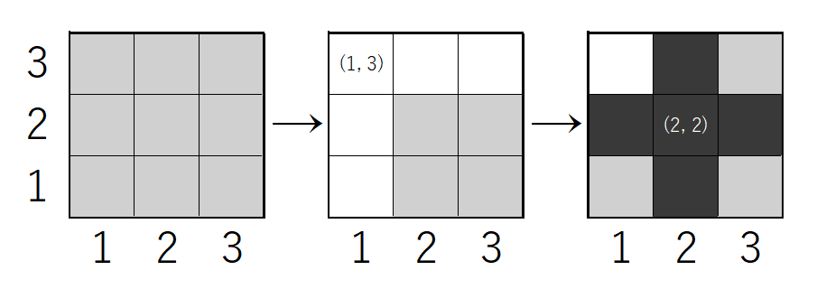

# Q5B 	Black vs White

## 問題文

(この物語はフィクションです。現実には何の関係もございません。)

太郎君がいろいろと勝負で勝ちすぎたため、すべてのプライドをかけてキ・カゾエールノ＝ダイスキーが決闘を仕掛けてきました

決闘罪で警察に突き出して良いですが、太郎君は気分が良いので引き受けました

太郎君は**黒い**木を、キ・カゾエールノ＝ダイスキーは**白い**木を、

正方形のマスの領域にたくさん自分の木を植えた方の勝ちだと言います

木を植えたときに、その木の**縦、横の列は全て自分の木が上書きで生えてきます**

お互いに木を生やしまくって数が多かった方の勝利です

あなたは審判システムを作って太郎君が勝ったか負けたかを報告してください

盤面の一辺のマス数
$N$、木を植えた数
$M$、木の色
$C_i$、植える座標
$X_i, Y_i$が与えられます

太郎君が勝ったならば`win`、負けたならば`lose`、引き分けならば`draw`と出力してください

## 入出力例

**入力**

$N \ M$

$C_1 \ X_1 \ Y_1$

$C_2 \ X_2 \ Y_2$

...

$C_M \ X_M \ Y_M$

**出力**

$S_o$

整数
$N, M$が入力として与えられます

$C_i$は木の色が**黒い**ならば`B`、**白い**ならば`W`となります

座標
$(X_i, Y_i)$に
$C_i$色の木を植えます

答えとなる文字列
$S_o$を出力してください。

## 制約

$N, M$は整数である。

$C_i$は`B`または`W`

$X_i, Y_i$は整数である。

$1\leq N \leq 10$

$1 \leq M \leq 10$

$1 \leq X_i, Y_i \leq N$

## サンプルケース

### 例1

入力

### `3 2`

### `W 1 3`

### `B 2 2`

出力

### `win`

次のような試合でした

まず、
$(1, 3)$が白色の木が植えられたため、
$(1, 1) \ (1, 2) \ (2, 3) \ (3, 3)$は白色の木が自動的に生えてきます

次に黒色の木が
$(2, 2)$に植えられたため、
$(1, 2) \ (3, 2) \ (2, 1) \ (2, 3)$は黒い木で上書きされます

最終的に黒色4本、白色1本で太郎君の勝ちのため、`win`と出力してください

