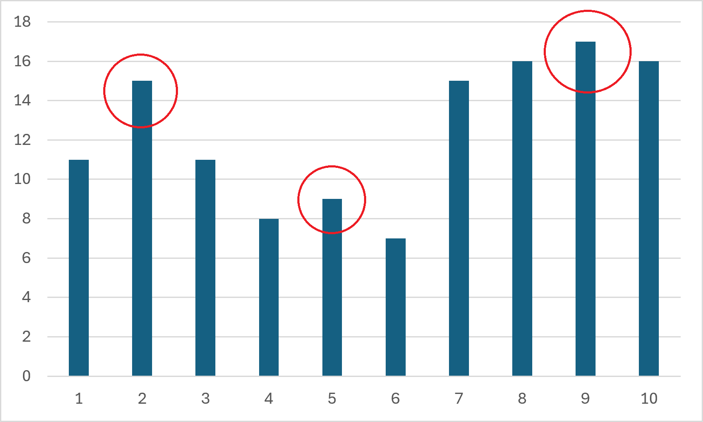

# Q5B 	Mountain

## 問題文

人生、山あり谷ありです

いいことがあったと思えば、残念なこともある...それが人生というものです

しかし、最初から山の数が分かっていれば気の持ちようは考えられます

ということで、山の数を数えてみましょう！

山の数を調べるには「山頂」の数を数え、一つの山は一つの山頂があるため、山頂の数だけ山があると分かるはずです（？）

要素
$A_i$の両隣の要素
$A_{i+1}, A_{i-1}$が両方とも
$A_i$ **より小さい** 場合、「山頂」と呼びます

ただし、
$A_i$ から
$A_{i+n}$ まで、値がすべて同じかつ、
$A_{i-1}, A_{i+n+1}$が両方とも
$A_i$ より小さい場合、
$A_i$ から
$A_{i+n}$ までを**まとめて一つの「山頂」** と呼びます

要素数
$N$、数列
$A_i$が与えられます

山頂の数を出力してください

## 入出力例

**入力**

$N$

$A_1 \ A_2 \ A_3 \ ... \ A_N$

**出力**

$N_o$

整数
$N$が入力として与えられます

数列
$A_i$が
$N$個与えられます

答えとなる整数
$N_o$を出力してください。

## 制約

$N$は整数である。

$A_i$は整数である。

$3 \leq N \leq 1000$

$1 \leq A_i \leq 100$

## サンプルケース

### 例1

入力

### `5`

### `12 51 88 14 56`

出力

### `1`

3番目の要素は「山頂」と言えます
そのため、1つ「山頂」があるため、`1`と出力してください

### 例2

入力

### `10`

### `11 15 11 8 9 7 15 16 17 16`

出力

### `3`

グラフにすると次のようになります

赤い丸があるところが、「山頂」と呼ばれる場所です

3つ存在するため、`3`と出力してください

### 例3

入力

### `5`

### `1 2 2 2 1`

出力

### `1`

山頂が同じ高さのため、
$A_2$ から
$A_4$ までを一つと数えます

よって`1`と出力してください

### 例4

入力

### `5`

### `1 2 3 4 5`

出力

### `0`

山頂が一つもない可能性もあります